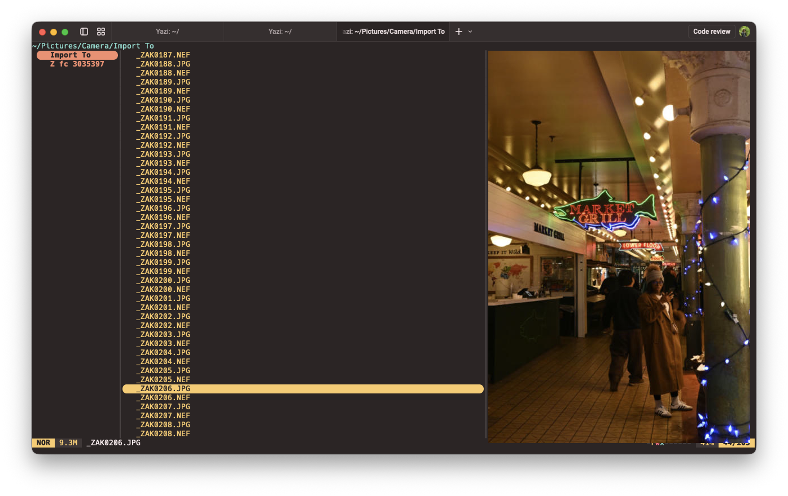

<div align="center">
  
</div>

<h3 align="center">
	Monokai flavor for <a href="https://github.com/sxyazi/yazi">Yazi</a>
</h3>

## 👀 Preview



## 🎨 Installation

Clone the repository and run the install script. It will copy all themes to your Yazi flavors directory and prompt you to select one to enable.

**macOS / Linux:**

```sh
git clone https://github.com/ZacharyEggert/monokai-pro-ristretto.yazi.git
cd monokai-pro-ristretto.yazi
bash install.sh
```

**Windows (PowerShell):**

```powershell
git clone https://github.com/ZacharyEggert/monokai-pro-ristretto.yazi.git
cd monokai-pro-ristretto.yazi
.\install.ps1
```

The script will write your selection to `theme.toml` automatically.

See the [Yazi flavor documentation](https://yazi-rs.github.io/docs/flavors/overview) for more details.

## 📜 License

The flavor is MIT-licensed, and the included tmTheme is also MIT-licensed.

Check the [LICENSE](LICENSE) and [LICENSE-tmtheme](LICENSE-tmtheme) file for more details.
